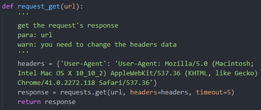
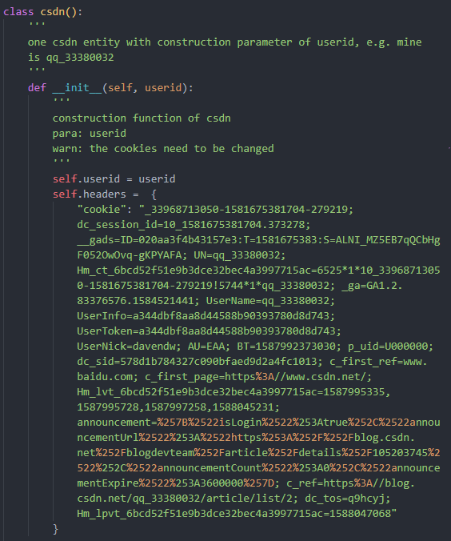
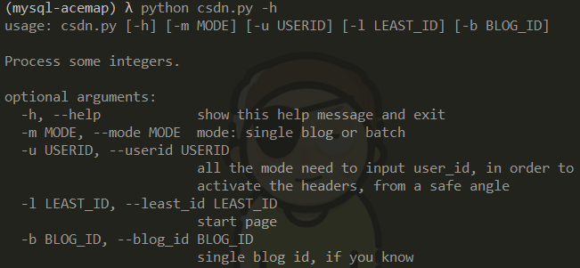

# CSDN-Blog-Saver

CSDN博客保存到本地(markdown源码) 
- 技术栈：python  selenium

### 运行环境

- 确认支持**windows**
  - 已测试：win10.0.17134   Python3.6.2
- 依赖包见requirements.txt

### 使用方法

**stage0:**

`pip install -r requirements.txt`

**stage1: 基础request的header修改（可省）**

**stage2: 根据获得的id获取markdown源码（需要设置cookies）**

**stage3: 执行程序**
`python csdn.py -u your_userid -l least_page` 

### 可能的运行错误

由于网络环境和硬件性能的差异，`time.sleep`的时间自行调节