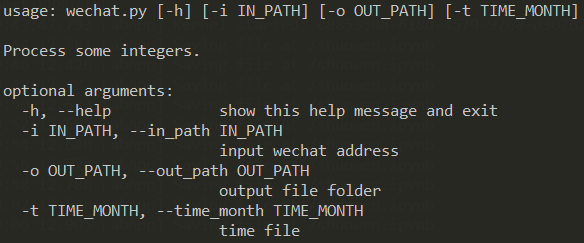

# WeChat Image Recover Tool

将微信的特定时间点的图片缓存转化为原图，用于恢复撤回的图片和已经过期未且保存的图片。

### 运行环境

- 目前只支持**windows**
	- 已测试：win10.0.17134   
- Python3.6.2
- 第三方包见requirements.txt

### 使用方法

**stage0:**

`pip install -r requirements.txt`

**stage1: 基于python环境进行运行**

打开命令行 `WIN+R`，输入`CMD`，调出命令行。

`python  wechat.py -i /wechat/image/file/storage -o default/folder/is/data/` -t "YYYY-MM" -m "all/test"

### 可能的运行错误

大概率不存在